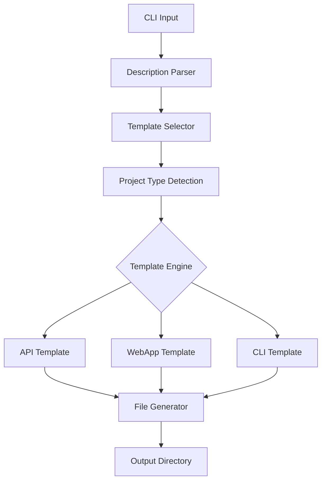

# 🔥 Zeus

> Build full-stack apps from natural language descriptions

[](https://github.com/MukundaKatta/zeus/actions)
[](LICENSE)
[]()

## What is Zeus?

Zeus is an AI-powered CLI tool that generates complete, production-ready web applications from natural language descriptions. Describe what you want, and Zeus scaffolds a full-stack project with a FastAPI backend, React frontend, database models, and deployment configuration — all from a single command.

## ✨ Features

- ✅ Natural language to full-stack application generation
- ✅ Template-based scaffolding with Jinja2
- ✅ Support for API, Web App, and CLI project types
- ✅ Configurable project structure and dependencies
- ✅ Rich terminal output with progress indicators
- 🔜 AI-powered code generation with LLM backends
- 🔜 Interactive project customization wizard

## 🚀 Quick Start

```bash
pip install -e .
zeus generate "A todo app with user authentication and REST API"
zeus list-templates
zeus init my-new-project
```

## 🏗️ Architecture



## 🛠️ Tech Stack

- **Click** — CLI framework
- **Rich** — Terminal formatting and progress bars
- **Jinja2** — Template rendering engine
- **Pydantic** — Configuration and validation
- **httpx** — HTTP client for AI backends

## 📖 Inspired By

This project was inspired by [v0.dev](https://v0.dev) and [bolt.new](https://bolt.new) but takes a different approach by focusing on CLI-first, template-driven generation that works entirely offline.

---

**Built by [Officethree Technologies](https://github.com/MukundaKatta)** | Made with ❤️ and AI
